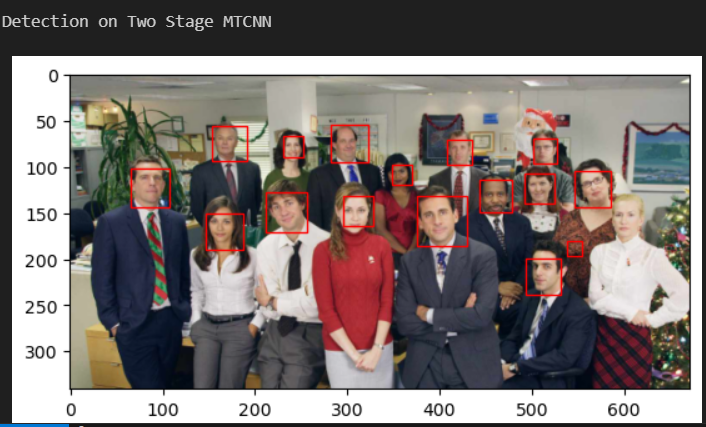

# Efficient Edge Deployment of MTCNN: Optimizing for Faster Inference and Reduced Model Size

#### Ensure ``pytorch, numpy, cv2`` is installed 

This is the variation of the conventional MTCNN model. The model uses 2 nets - P NET and R NET to detect faces.
This variant of MTCNN is optimized for edge devices for faster inference speeds and lower memory consumption

Note: Download the WIDERFACE dataset. The dataset should contain these folders
```
├── WIDER_FACE
│   ├── wider_face_split
│   ├── WIDER_test
│   ├── WIDER_train
│   └── WIDER_val
```

### Generate Training Data for PNET and RNET
step 1: `cd datagen`  
step 2: `python gen_pnet_train_run.py -d <location to WIDERFACE directory>` to generate training data for PNET training  
step 3: `python gen_rnet_train_run.py -d <location to WIDERFACE directory> -m ../output/trainedModels/pnet.pth` to generate data for RNET training  

### Train PNET and RNET
step 1: `cd ../trainnets`  
step 2: `python train_pnet.py -e 10 -b 256 -o ../output/trainedModels/pnet.pth -dv cuda:0 -r False` to train PNET  
step 3: `python train_rnet.py -e 10 -b 256 -o ../output/trainedModels/rnet.pth -dv cuda:0 -r False` to train RNET  

### Inference
step 1: `cd ..`  
step 2: Follow ``inference_speed_analysis.ipynb``

### In development  
step 1: `cd ..`  
step 2: `detectCam.py`

## Sample Detection Result


## Inference Speed Up Analysis


#### Credit to [FaceDetector by BrightXiaoHan](https://github.com/BrightXiaoHan/FaceDetector)

